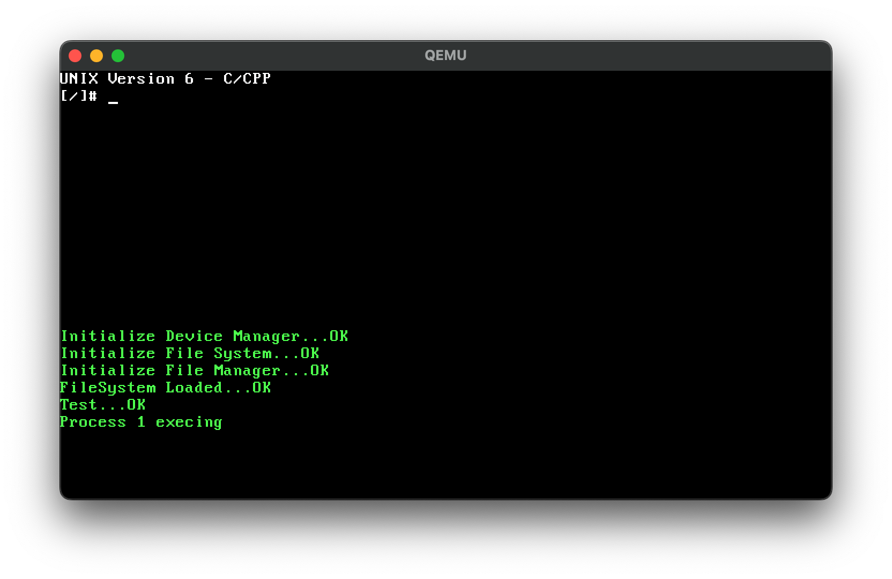
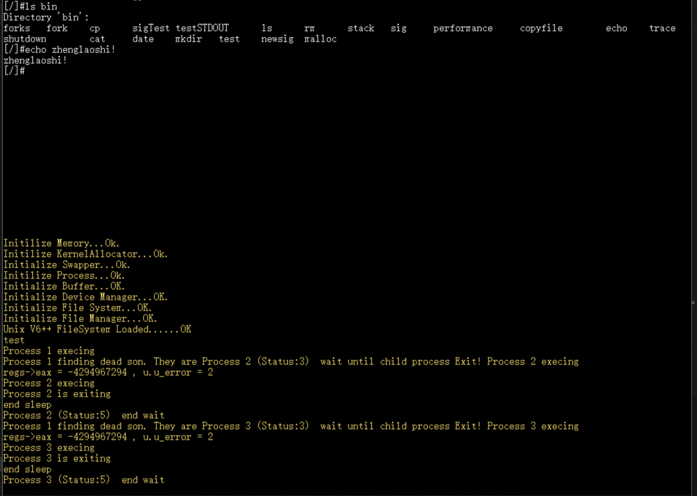

# Unix V6 C/C++

A Unix V6 system developed for the IA-32 architecture.

## Build and Run

The project requires:

CMake, Ninja, NASM, GNU Make, QEMU. 

On macOS, the
`x86_64-elf` cross-compilation toolchain is also required.

Run the following commands from the project root. First, build the local file
system editor used to create the disk image:

```sh
bash init.sh
```

Then compile the system, create `target/c.img`, and start it in QEMU:

```sh
make qemu
```

The build and launch steps can also be run separately:

```sh
make                  # Compile the system and create target/c.img
make qemu-no-rebuild  # Start the existing image without rebuilding
```

To start QEMU paused and waiting for a GDB connection, use:

```sh
make qemug
```

After changing the file system editor, rerun `bash init.sh`. To perform a clean
build, remove the generated system files and rebuild:

```sh
make clean
bash init.sh
make qemu
```

## Physical Memory Layout

| Start address | End address (inclusive) | Size  | Purpose and notes                     |
| :-----------: | :---------------------: | :---: | :------------------------------------ |
|      0        |           3FF           | 1 KB  | Interrupt vectors (reserved by BIOS)  |
|      400      |           4FF           | 256 B | BIOS data (reserved by BIOS)          |
|     1000      |          1FFF           | 4 KB  | PML2 used during boot                 |
|       ?       |          7BFF           |   ?   | Kernel stack used during boot         |
|     7C00      |          7DFF           | 512 B | Bootloader: first-stage loader        |
|     7E00      |          7EFF           | 256 KB | VBE Mode Info                        |
|     9FC00     |          9FFFF          | 1 KB  | Extended BIOS data area (BIOS-reserved) |

The build system uses both CMake and Makefiles. The Makefile provides the user-facing commands and invokes CMake to perform the compilation and build steps. It generates both ELF and PE versions of each program: the ELF versions are used by GDB, while the PE versions are loaded by the Unix kernel.

The VS Code configuration files provide C++ header search paths and debugger launch settings.

QEMU has replaced Bochs as the virtual machine, and the VM memory has been increased from 32 MB to 64 MB.

#### File System Layout

The original version limited the kernel image to 99 KB. In fact, the old system was already very close to that limit, so adding new features could easily make the kernel too large to load completely. By moving the file system's inode region and all subsequent regions farther back, the kernel limit has been increased to 398 disk blocks, or 199 KB, which should be sufficient for now.

| Contents              | Previous blocks | Current blocks |
| --------------------- | --------------- | -------------- |
| Bootloader (`boot.bin`) | [0, 0]        | [0, 0]         |
| Kernel (`kernel.bin`) | [1, 199]        | [1, 399]       |
| SuperBlock            | [200, 201]      | [400, 401]     |
| Inode                 | [202, 1023]     | [402, 1223]    |
| Data                  | [1024, 17999]   | [1224, 18199]  |
| Swap                  | [18000, 20159]  | [18200, 20359] |

Changes:

```cpp
// git diff ./src/include/FileSystem.h
-       static const int SUPER_BLOCK_SECTOR_NUMBER = 200; 
+       static const int SUPER_BLOCK_SECTOR_NUMBER = 400;   

-       static const int INODE_ZONE_START_SECTOR = 202; 
-       static const int INODE_ZONE_SIZE = 1024 - 202;  
+       static const int INODE_ZONE_START_SECTOR = 402; 
+       static const int INODE_ZONE_SIZE = 1224 - 402;  
 
-       static const int DATA_ZONE_START_SECTOR = 1024;   
-       static const int DATA_ZONE_END_SECTOR = 18000 - 1;  
-       static const int DATA_ZONE_SIZE = 18000 - DATA_ZONE_START_SECTOR; 
+       static const int DATA_ZONE_START_SECTOR = 1224;   
+       static const int DATA_ZONE_END_SECTOR = 18200 - 1; 
+       static const int DATA_ZONE_SIZE = 18200 - DATA_ZONE_START_SECTOR; 

// git diff ./src/mm/SwapperManager.cpp
-unsigned int SwapperManager::SWAPPER_ZONE_START_BLOCK = 18000;
+unsigned int SwapperManager::SWAPPER_ZONE_START_BLOCK = 18200;
```

The original PE parser assumed fixed names and positions for each section, but newer compilers do not necessarily follow that convention, which could prevent executables from loading correctly. The new PE parser locates the required program sections by matching their names. Several bugs in the original PE parser have also been fixed.

Because ELF is the native executable format of the Unix family, and GDB on GNU/Linux has problems loading PE files, an ELF loader has also been implemented. It currently contains bugs and is not yet usable.

The splash image, `splash.bmp`, is briefly displayed during boot.


The splash screen can be disabled in `src/CMakeLists.txt`.

CPU PSE is enabled during boot to support 4 MB large-page mappings. See [OSDev Wiki: Paging](https://wiki.osdev.org/Paging).

The display uses VESA and provides a console with more screen space, richer colors, and scrolling support. This version of the VESA driver has only been tested successfully on QEMU and is not guaranteed to work correctly in other environments. The VESA framebuffer is mapped 128 MB into kernel space (3 GB + 128 MB), and its total size is approximately 2 MB. VESA support can be enabled or disabled manually in `src/CMakeLists.txt`.

| CRT                                      | VESA                                     |
| ---------------------------------------- | ---------------------------------------- |
|  |  |

The original version did not explicitly enable DMA, possibly because Bochs enabled it by default and the issue therefore went unnoticed. The chipset emulated by QEMU disables DMA by default, so it must be enabled explicitly.

The `libunixstd` library provides more functionality and better performance:

1. Its `strlen` implementation, based on the one in `glibc`, checks four bytes at a time.
2. Its optimized `memcpy` copies four bytes at a time when the arguments are properly aligned. This significantly improves scrolling performance in the VESA console. AVX or SSE instructions could potentially improve it further.
